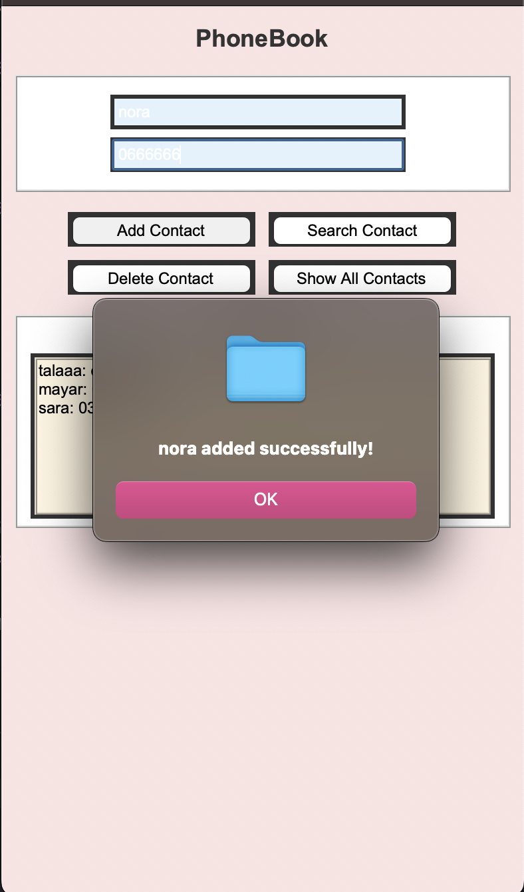

# 📞 PhoneBook Project

A **PhoneBook Application** built with **Java** and **Python (Tkinter)** for managing contacts efficiently. It allows users to **add, search, edit, and delete** contacts with a visually appealing UI.

---

## 🌟 Features
- **📋 Contact Management** – Add, edit, delete, and search for contacts.
- **🎨 Modern UI** – A simple and elegant interface.
- **📤 Data Persistence** – Stores contacts efficiently.
- **🚀 Fast & Lightweight** – Uses **BST (Binary Search Tree)** for fast retrieval.

---

## 🖥️ Interface Preview
Here is a preview of the PhoneBook app:



---

## 🛠️ Technologies Used
This project is built using:
- **Java** – For backend logic and data structure management.
- **Python (Tkinter)** – For the graphical user interface (GUI).
- **Binary Search Tree (BST)** – For efficient contact searching.
- **Linked List** – For handling events related to contacts.

---

## 🚀 How to Run
### **🔹 Running the Java Backend**
```bash
javac PhoneBook.java
java PhoneBook
